Distracted Driving Analysis
========================================================
author: Bryan Yu
date: August 5 2018
autosize: true

Committee:   Dr. Derya Akleman, Dr. Samiran Sinha, Dr. Ergun Akleman

Experiment
========================================================

Controlled simulated driving experiment1 to asses driving behavior]

Multiple different stressors for drives (cognitive, emotional, sensorimotor (texting) 

Sensors captured vehicle information and driver outputs

Objective
========================================================

Model volatility of lane positioning with regards to texting effect and population effects (age cohort)

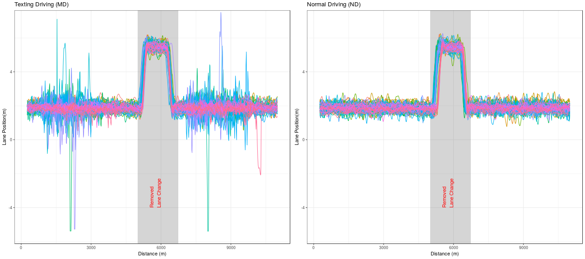

* Each color is a separate driver (N=68)
* Data resampled at 390 data points (Prior to lane change: 200; After lane change: 190)
* Two models, one prior to lane change, one after
* Missing data filtered

Summary 
========================================================

**Assignment 2-3**: Linear regression on aggregated data set (per driver & drive, modelling standard deviation of lane positioning) and found divergence with model. The standard deviation of eye gaze and different population cohorts is inadequate to understanding the volatility of lane positioning. (Not included in this report to keep report concise)

**Assignment 4**: Focused this analysis on driver T001 with time-series AR(1) in the sensorimotor driving (MD) section with phase 1 and 2 with bayesian posterior distribution checks. I had some difficulties with using generative model on covariates in the time series model but believe I can solve this with more time.

**Assignment 5**: 

* Binned data to have equal sample sizes across all drivers 
* Fit AR(1) model on normal driving for `T021`. 
  * Model looks good but there are some prior samples with divergences, this is likely a minor issue for a simple model
  * AR(1) was shown not to be effective in the texting driving as expected
  
* Modelled ARCH(1) with texting driving but still working on generative ensemble

## Future Steps

1. Iterate on time series model with adding a stochastic volatilty model or heteroscedastic model (ARCH) with covariates

2. Inference for all drivers

3. Change-point model (account for driving phases)

Single driver (T021)
========================================================
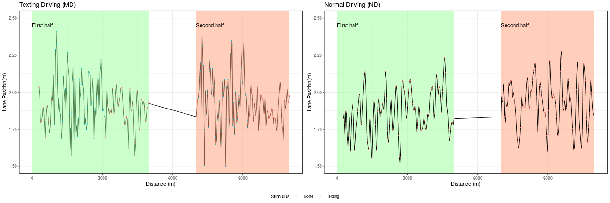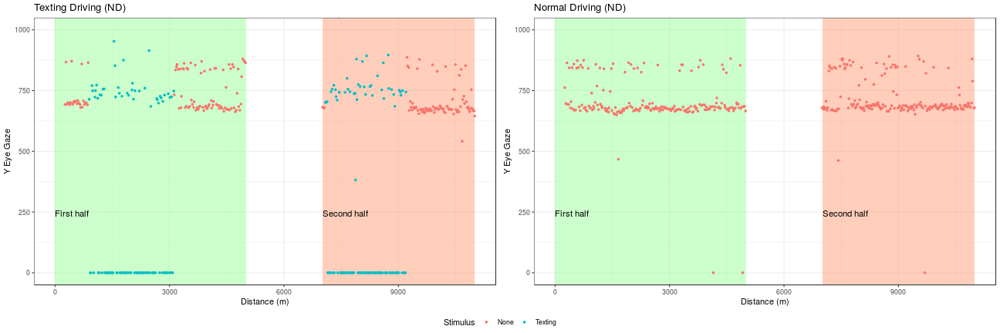

**First half ACF analysis**

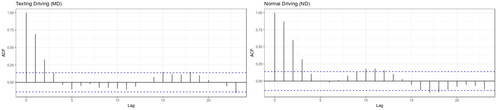

AR(1) of Normal Driving (ND)
========================================================

**Conceptual Analysis**

Single driver staying in the middle of a lane (3.65m wide). Should expect that as the driver moves out of the middle of lane to correct by reducing lane position back to middle (~1.825m). Would expect that mean and variance is constant.

**Summary Statistic**
Correlogram with posterior predictive check

**Generative Model (prior and likelihood)**
In order to stay stationary, $\rho$ should be below 1 and should be positive as the driver moves outside the middle of lane to regress back to the mean. Prior for $\rho$ should be below 1. Symmetric beta prior will be useful to to have a bounded (0, 1) distribution.

$$\rho \sim \textrm{Beta}(1.5, 1.5)$$

$$y_n \sim \mathcal{N}(\alpha + \rho_{n-1}, \sigma)$$

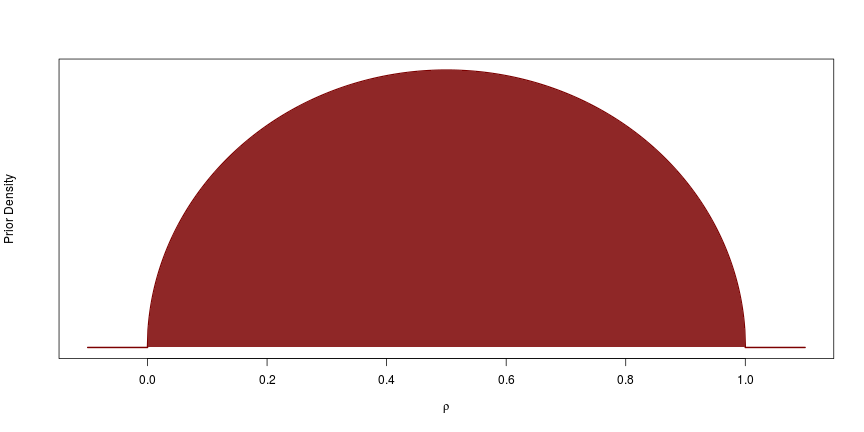

Prior predictive distribution
========================================================

#### Analyze the prior predictive distribution
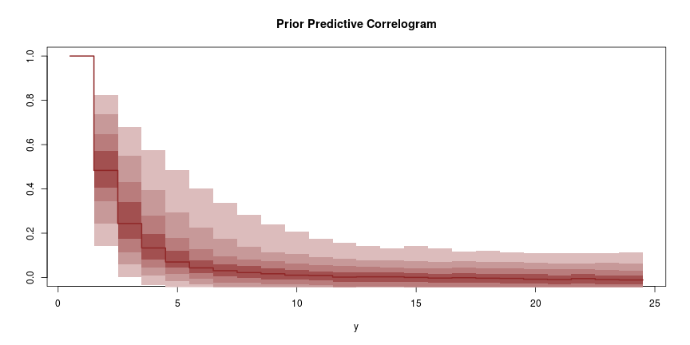

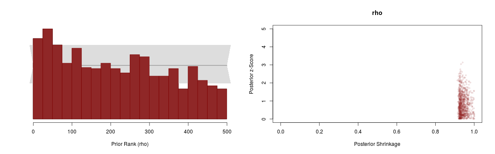

* Simulation based calibration test: Close to uniform
* Posterior shrinkage shows highly informative observations (Close to 1)
* Posterior z-score shows that posterior recovers parameters (Most below 3)

Fitting actual observations
========================================================

<table class="table table-striped table-hover" style="margin-left: auto; margin-right: auto;">
 <thead>
  <tr>
   <th style="text-align:left;">   </th>
   <th style="text-align:right;"> mean </th>
   <th style="text-align:right;"> se_mean </th>
   <th style="text-align:right;"> sd </th>
   <th style="text-align:right;"> 50% </th>
   <th style="text-align:right;"> n_eff </th>
   <th style="text-align:right;"> Rhat </th>
  </tr>
 </thead>
<tbody>
  <tr>
   <td style="text-align:left;"> rho </td>
   <td style="text-align:right;"> 0.8672803 </td>
   <td style="text-align:right;"> 0.0011922 </td>
   <td style="text-align:right;"> 0.0364570 </td>
   <td style="text-align:right;"> 0.8666811 </td>
   <td style="text-align:right;"> 935.1587 </td>
   <td style="text-align:right;"> 1.000429 </td>
  </tr>
  <tr>
   <td style="text-align:left;"> alpha </td>
   <td style="text-align:right;"> 0.2471362 </td>
   <td style="text-align:right;"> 0.0022316 </td>
   <td style="text-align:right;"> 0.0681416 </td>
   <td style="text-align:right;"> 0.2481566 </td>
   <td style="text-align:right;"> 932.4202 </td>
   <td style="text-align:right;"> 1.000328 </td>
  </tr>
  <tr>
   <td style="text-align:left;"> sigma </td>
   <td style="text-align:right;"> 0.0712586 </td>
   <td style="text-align:right;"> 0.0000929 </td>
   <td style="text-align:right;"> 0.0036797 </td>
   <td style="text-align:right;"> 0.0709669 </td>
   <td style="text-align:right;"> 1568.4452 </td>
   <td style="text-align:right;"> 1.004402 </td>
  </tr>
</tbody>
</table>

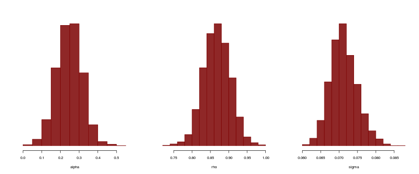

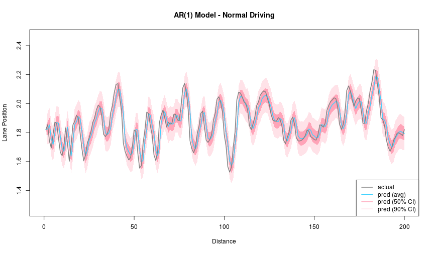

Analyze the posterior predictive distribution (Normal drive)
========================================================

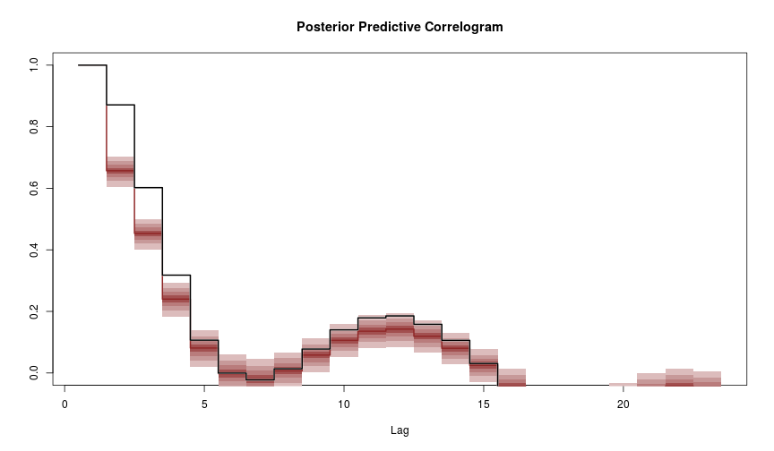

Still some weirdness in the first lags but fit captures the structure of data

AR(1) of Texting driving (MD)
========================================================

<table class="table table-striped table-hover" style="margin-left: auto; margin-right: auto;">
 <thead>
  <tr>
   <th style="text-align:left;">   </th>
   <th style="text-align:right;"> mean </th>
   <th style="text-align:right;"> se_mean </th>
   <th style="text-align:right;"> sd </th>
   <th style="text-align:right;"> 50% </th>
   <th style="text-align:right;"> n_eff </th>
   <th style="text-align:right;"> Rhat </th>
  </tr>
 </thead>
<tbody>
  <tr>
   <td style="text-align:left;"> rho </td>
   <td style="text-align:right;"> 0.6856378 </td>
   <td style="text-align:right;"> 0.0015687 </td>
   <td style="text-align:right;"> 0.0523717 </td>
   <td style="text-align:right;"> 0.6867114 </td>
   <td style="text-align:right;"> 1114.649 </td>
   <td style="text-align:right;"> 1.001742 </td>
  </tr>
  <tr>
   <td style="text-align:left;"> alpha </td>
   <td style="text-align:right;"> 0.6014627 </td>
   <td style="text-align:right;"> 0.0030153 </td>
   <td style="text-align:right;"> 0.1006576 </td>
   <td style="text-align:right;"> 0.5987233 </td>
   <td style="text-align:right;"> 1114.350 </td>
   <td style="text-align:right;"> 1.001831 </td>
  </tr>
  <tr>
   <td style="text-align:left;"> sigma </td>
   <td style="text-align:right;"> 0.1023616 </td>
   <td style="text-align:right;"> 0.0001233 </td>
   <td style="text-align:right;"> 0.0051134 </td>
   <td style="text-align:right;"> 0.1022333 </td>
   <td style="text-align:right;"> 1718.558 </td>
   <td style="text-align:right;"> 1.001202 </td>
  </tr>
</tbody>
</table>

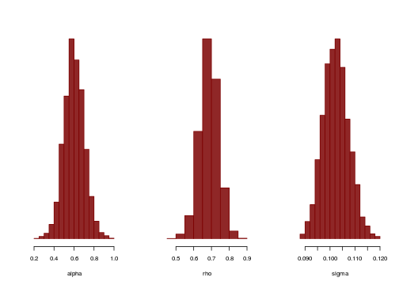

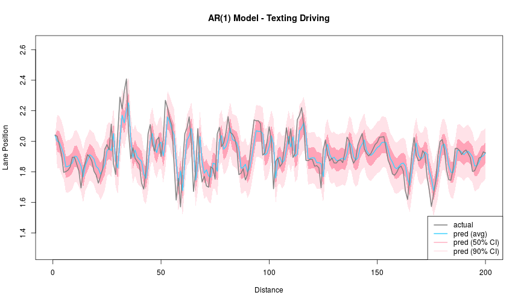

Analyze the posterior predictive distribution (Texting)
========================================================
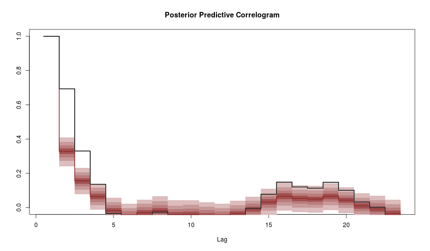

Not as great of a fit... as expected

ARCH(1) / GARCH(1, 1) of Texting driving (MD)
========================================================

*ARCH*
$$\sigma_t^2 = \alpha_0 + \alpha_{texting} + \alpha_1 a^2_{t-1}$$

*GARCH*
$$\sigma_t^2 = \alpha_0 + \alpha_{texting} + \alpha_1 a^2_{t-1} + \beta \sigma^2_{t-1}$$

Still in progress ... generative ensemble difficult with current priors
